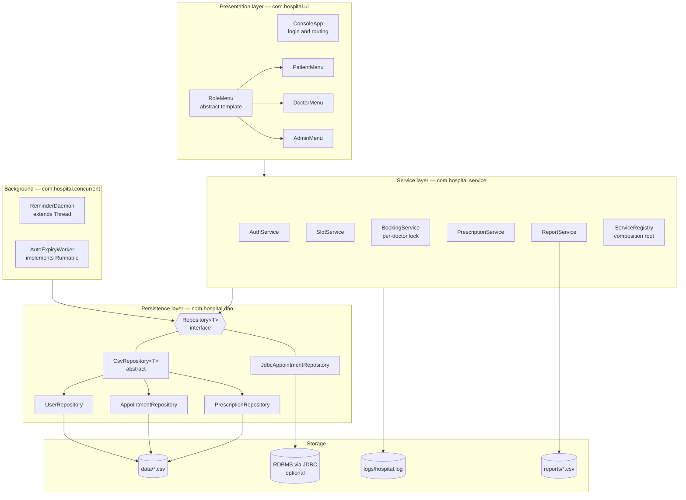
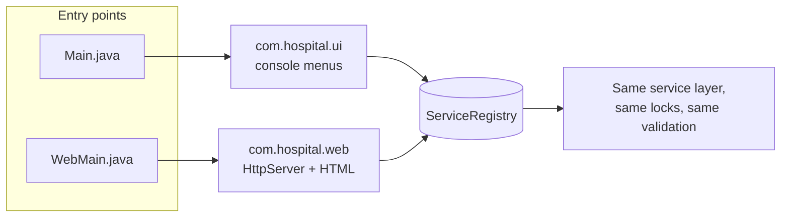
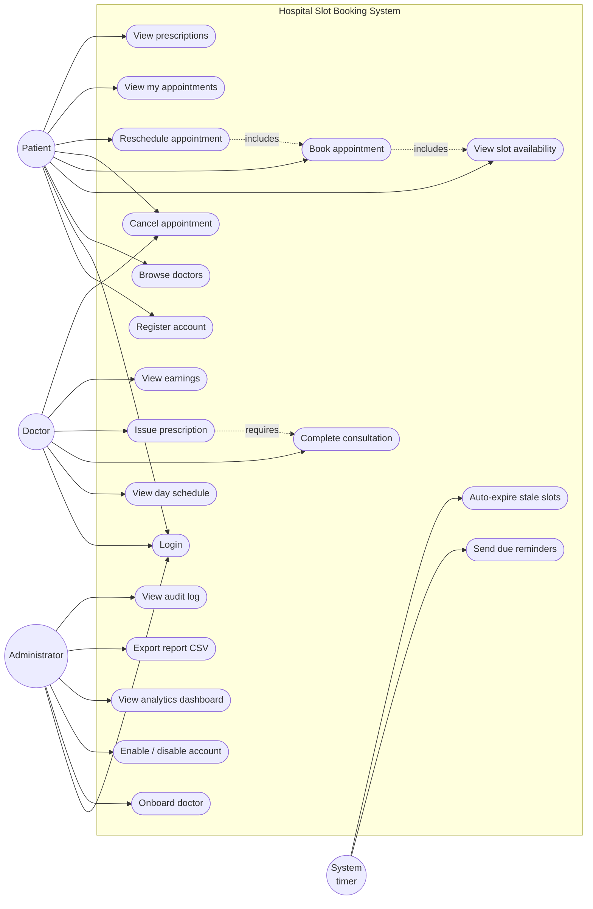
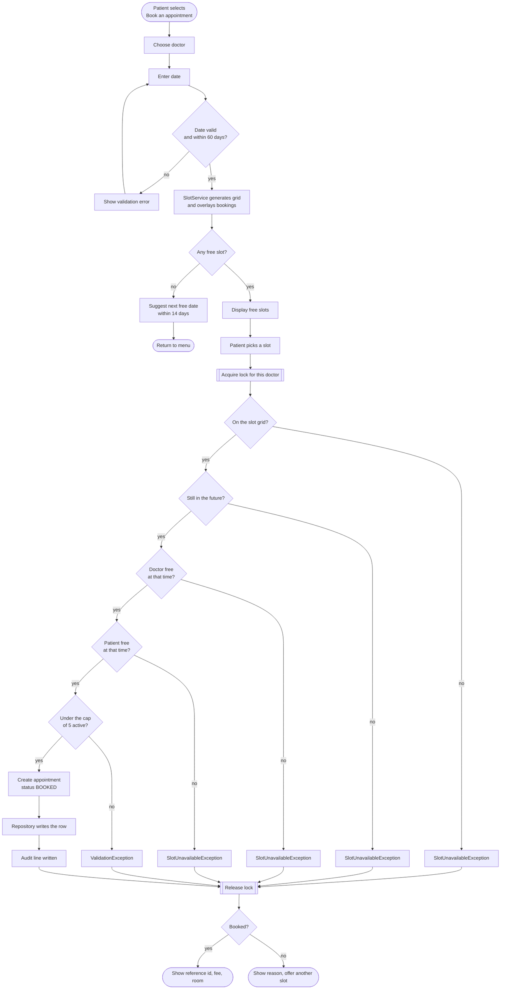
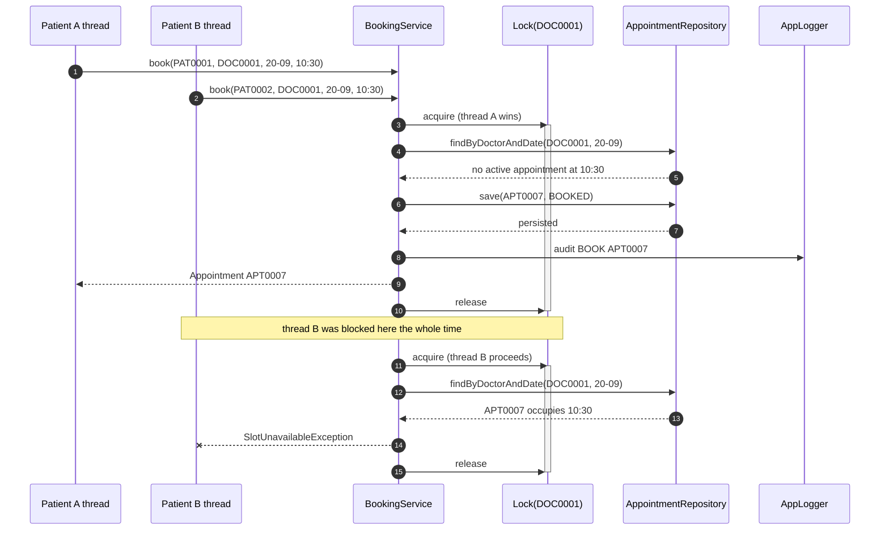
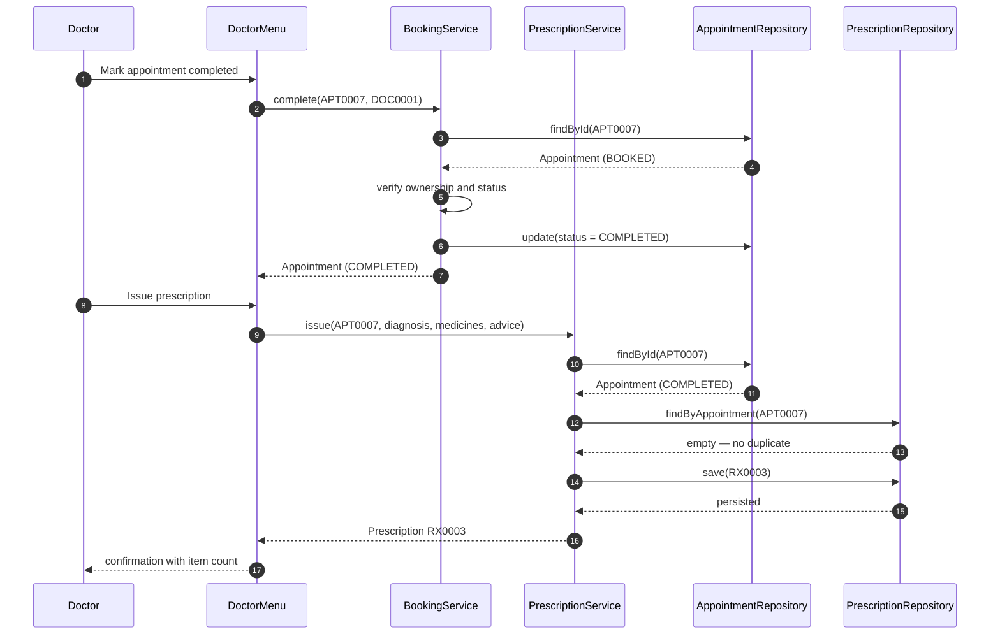
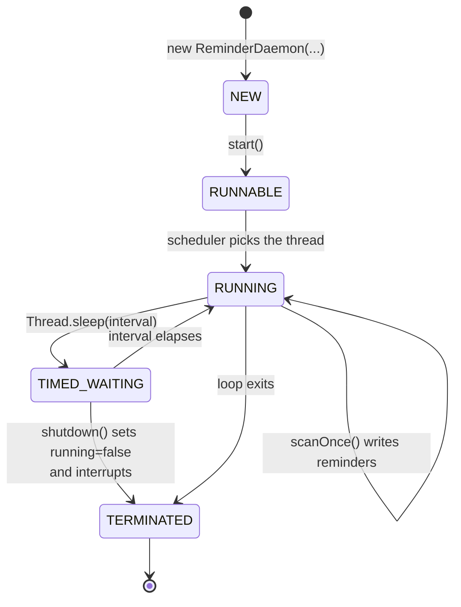

# Architecture & Design Diagrams

All diagrams are Mermaid, so they render directly on GitHub. For the PDF
report, screenshot the rendered versions or paste the source into
[mermaid.live](https://mermaid.live) and export PNG/SVG.

---

## 1. System architecture

A four-layer design. Each layer depends only on the one below it, and the
service layer depends on the `Repository<T>` *interface* rather than on any
concrete storage class.



**Why this shape.** The one rule that earns its keep is that no service ever
names a storage class. `BookingService` asks an `AppointmentRepository` for
appointments, but its only assumption is the `Repository<Appointment>`
contract, which is exactly why the JDBC implementation can be swapped in at
the `ServiceRegistry` without touching a line of business logic.

**Two front ends, one backend.** `com.hospital.ui` (console) and
`com.hospital.web` (browser) are both presentation layers that call the
identical `ServiceRegistry`. Neither knows the other exists. This is the same
reason `Repository<T>` lets the JDBC and CSV implementations swap freely —
programming to an interface (here, effectively the service layer's public
methods) is what makes a second front end a pure addition rather than a
rewrite.



The web layer adds three small classes with a single responsibility each:

| Class | Responsibility |
|---|---|
| `WebServer` | Routes each HTTP request to a handler method that calls the service layer and renders a response |
| `SessionManager` | Maps a cookie token to a logged-in `User`, thread-safe via `ConcurrentHashMap` |
| `Html` | Builds and escapes HTML fragments — no templating engine, so the project stays dependency-free |

---

## 2. Use case diagram



---

## 3. Class diagram

```mermaid
classDiagram
    class User {
        <<abstract>>
        -String id
        -String username
        -String passwordHash
        -String fullName
        -String phone
        -boolean active
        +getRole()* Role
        +describe() String
    }
    class Patient {
        -int age
        -String gender
        -String bloodGroup
        +describe() String
    }
    class Doctor {
        -Specialization specialization
        -double consultationFee
        -String roomNo
        -LocalTime workStart
        -LocalTime workEnd
        -int slotMinutes
        +slotsPerDay() int
    }
    class Admin {
        -String designation
    }
    class Billable {
        <<interface>>
        +calculateBill() double
        +taxComponent() double
    }
    class Appointment {
        -String id
        -String patientId
        -String doctorId
        -LocalDate date
        -LocalTime startTime
        -LocalTime endTime
        -AppointmentStatus status
        -double fee
        +calculateBill() double
        +overlaps(date, start, end) boolean
        +startsAt() LocalDateTime
    }
    class Slot {
        -LocalDate date
        -LocalTime start
        -LocalTime end
        -boolean booked
        +isBookable() boolean
        +statusLabel() String
    }
    class Prescription {
        -String id
        -String appointmentId
        -String diagnosis
        -List~String~ medicines
        -String advice
    }

    User <|-- Patient
    User <|-- Doctor
    User <|-- Admin
    Billable <|.. Appointment

    class Repository~T~ {
        <<interface>>
        +save(T) T
        +update(T) void
        +deleteById(String) boolean
        +findById(String) Optional~T~
        +findAll() List~T~
    }
    class CsvRepository~T~ {
        <<abstract>>
        #Path file
        #toCsv(T)* String
        #fromCsv(String)* T
        #idOf(T)* String
        #load() List~T~
        #flush() void
    }
    class UserRepository
    class AppointmentRepository
    class PrescriptionRepository
    class JdbcAppointmentRepository

    Repository <|.. CsvRepository
    Repository <|.. JdbcAppointmentRepository
    CsvRepository <|-- UserRepository
    CsvRepository <|-- AppointmentRepository
    CsvRepository <|-- PrescriptionRepository

    class AuthService {
        +login(user, pass) User
        +registerPatient(...) Patient
        +registerDoctor(...) Doctor
        +changePassword(...) void
    }
    class SlotService {
        +generateGrid(Doctor, date) List~Slot~
        +getSlots(Doctor, date) List~Slot~
        +getAvailableSlots(...) List~Slot~
        +occupancyRate(...) double
    }
    class BookingService {
        -Map~String,Object~ doctorLocks
        +book(...) Appointment
        +cancel(...) Appointment
        +complete(...) Appointment
        +reschedule(...) Appointment
    }
    class PrescriptionService {
        +issue(...) Prescription
        +historyOfPatient(id) List~Prescription~
    }
    class ReportService {
        +revenueByDoctor() Map
        +statusBreakdown() Map
        +dailyLoad() Map
        +exportAppointmentsCsv() Path
    }

    AuthService --> UserRepository
    SlotService --> AppointmentRepository
    BookingService --> AppointmentRepository
    BookingService --> UserRepository
    BookingService --> SlotService
    PrescriptionService --> PrescriptionRepository
    ReportService --> AppointmentRepository

    class RoleMenu {
        <<abstract>>
        +show() final
        #title()* String
        #options()* String[]
        #handle(String)* boolean
    }
    RoleMenu <|-- PatientMenu
    RoleMenu <|-- DoctorMenu
    RoleMenu <|-- AdminMenu

    class ReminderDaemon {
        -volatile boolean running
        +run() void
        +scanOnce() int
        +shutdown() void
    }
    class AutoExpiryWorker {
        +run() void
        +expireOnce() int
    }
    Thread <|-- ReminderDaemon
    Runnable <|.. AutoExpiryWorker

    Appointment "1" --> "0..1" Prescription
    Doctor "1" --> "*" Appointment
    Patient "1" --> "*" Appointment
```



---

## 4. Workflow / process flow — booking an appointment



Every rejection path sits *inside* the lock. If the checks ran before the
lock, another thread could book the slot in the gap between "is it free?" and
"write the row".

---

## 5. Sequence diagram — concurrent booking of the same slot



The 25-thread version of exactly this scenario is asserted in
`TestRunner.testConcurrentBookingRace()`.

---

## 6. Sequence diagram — consultation and prescription



---

## 7. Thread life cycle — ReminderDaemon



---

## 8. ER diagram / storage design

The default backend is file storage, but the records are modelled
relationally and the optional JDBC schema below mirrors them exactly.

```mermaid
erDiagram
    USER ||--o{ APPOINTMENT : "books / attends"
    DOCTOR ||--o{ APPOINTMENT : "serves"
    APPOINTMENT ||--o| PRESCRIPTION : "results in"
    DOCTOR ||--o{ SLOT : "exposes (derived)"

    USER {
        string id PK "PAT0001 / DOC0001 / ADM0001"
        string role "PATIENT | DOCTOR | ADMIN"
        string username UK
        string password_hash "base64(salt):base64(sha256)"
        string full_name
        string phone
        boolean active
    }
    PATIENT_FIELDS {
        int age
        string gender
        string blood_group
    }
    DOCTOR {
        string id PK
        string specialization
        double consultation_fee
        string room_no
        time work_start
        time work_end
        int slot_minutes
    }
    APPOINTMENT {
        string id PK
        string patient_id FK
        string doctor_id FK
        date appt_date
        time start_time
        time end_time
        string status "BOOKED|COMPLETED|CANCELLED|NO_SHOW"
        double fee
        string reason
        timestamp created_at
    }
    PRESCRIPTION {
        string id PK
        string appointment_id FK UK
        string diagnosis
        string medicines "semicolon separated"
        string advice
        timestamp issued_at
    }
    SLOT {
        string doctor_id FK
        date slot_date
        time start_time
        time end_time
        boolean booked "computed, never stored"
    }
```

### File layout

| File | Columns |
|---|---|
| `data/users.csv` | `id｜role｜username｜passwordHash｜fullName｜phone｜active｜f1..f7` — the `f` columns hold role-specific fields (single-table inheritance) |
| `data/appointments.csv` | `id｜patientId｜doctorId｜date｜startTime｜endTime｜status｜fee｜reason｜createdAt` |
| `data/prescriptions.csv` | `id｜appointmentId｜diagnosis｜medicines｜advice｜issuedAt` |
| `logs/hospital.log` | `timestamp [LEVEL] [thread] message` |
| `reports/appointments_*.csv` | Exported comma-separated dump with computed payable amounts |

Values are pipe-delimited; a literal `|` or newline inside a value is escaped
(`&#124;`, `&#10;`) so free-text fields cannot corrupt a row.

### Equivalent SQL schema (used by the JDBC backend)

```sql
CREATE TABLE appointments (
    id          VARCHAR(16) PRIMARY KEY,
    patient_id  VARCHAR(16) NOT NULL,
    doctor_id   VARCHAR(16) NOT NULL,
    appt_date   DATE        NOT NULL,
    start_time  TIME        NOT NULL,
    end_time    TIME        NOT NULL,
    status      VARCHAR(16) NOT NULL,
    fee         DOUBLE PRECISION NOT NULL,
    reason      VARCHAR(255),
    created_at  TIMESTAMP   NOT NULL
);

CREATE INDEX idx_doc_date ON appointments(doctor_id, appt_date);
```

The index matches the hottest query in the system — "what does this doctor
already have on this date?" — which every booking runs.

---

## 9. Non-functional requirements

| # | Requirement | How it is met | Where to verify |
|---|---|---|---|
| 1 | **Reliability / correctness under concurrency** | Per-doctor lock around the entire check-then-write sequence; `ConcurrentHashMap` for lock objects; `AtomicInteger` id generation; rollback on failed reschedule | `BookingService.book()`, `testConcurrentBookingRace` |
| 2 | **Security** | Salted SHA-256 hashing, no plain-text password stored or logged; login attempt limit of 3; role checks before every privileged action; `PreparedStatement` binding on the JDBC path | `PasswordUtil`, `AuthService`, `JdbcAppointmentRepository` |
| 3 | **Usability** | Numbered menus, sensible defaults on every prompt, specific error messages that state the rule that failed, next-free-date suggestion when a day is full | `Validator`, `PatientMenu` |
| 4 | **Maintainability** | Four layers with one-way dependencies, services coded against `Repository<T>`, template-method base classes remove duplication, Javadoc on every public type, 7 focused packages | project structure |
| 5 | **Error handling** | One checked exception hierarchy with error codes; low-level `IOException`/`SQLException` wrapped in `DataAccessException` with the cause preserved; corrupt rows skipped and logged rather than fatal; menu-level catch-all | `exception/`, `CsvRepository.load()` |
| 6 | **Logging / auditability** | Append-only log with timestamp, level and thread name; every login, booking, cancellation, completion and export recorded; admin can tail it in-app | `AppLogger`, admin option 8 |
| 7 | **Performance** | Lazy-loaded in-memory cache per repository; locks scoped per doctor so unrelated bookings run in parallel; indexed doctor+date query on the JDBC path | `CsvRepository`, `BookingService` |
| 8 | **Portability** | Pure JDK 17+, zero third-party jars, relative paths only, runs identically on Linux, macOS and Windows | `lib/README.md` |
